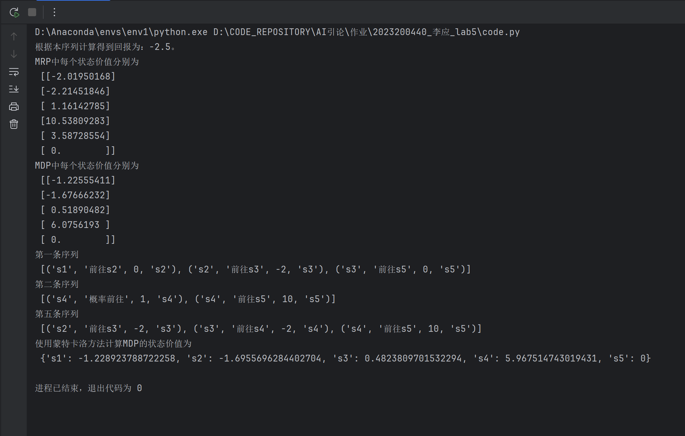

# 实验报告：马尔可夫奖励过程与蒙特卡罗方法

## 实验目标
本实验旨在通过模拟马尔可夫奖励过程（MRP）和马尔科夫决策过程，掌握序列问题中回报Gt的计算，\
通过贝尔曼方程求解和使用蒙特卡罗采样方法计算状态价值来探讨强化学习中决策过程的变化。

## 实验环境

实验使用Python和NumPy库来定义状态转移矩阵、奖励函数等，并进行采样和计算。

## 方法与步骤

### 1. 定义MRP

通过状态转移概率矩阵`P`与奖励函数逐步定义MRP。如下所示：

```python
import numpy as np

np.random.seed(0)

P = np.array([
    [0.9, 0.1, 0.0, 0.0, 0.0, 0.0],
    [0.5, 0.0, 0.5, 0.0, 0.0, 0.0],
    [0.0, 0.0, 0.0, 0.6, 0.0, 0.4],
    [0.0, 0.0, 0.0, 0.0, 0.3, 0.7],
    [0.0, 0.2, 0.3, 0.5, 0.0, 0.0],
    [0.0, 0.0, 0.0, 0.0, 0.0, 1.0],
])

rewards = [-1, -2, -2, 10, 1, 0]
gamma = 0.5
```

### 2. 计算回报
通过调用compute_return函数计算给定序列的回报。对于一个状态序列s1-s2-s3-s6：
```python
def compute_return(start_index, chain, gamma):
    G = 0
    for i in reversed(range(start_index, len(chain))):
        G = gamma * G + rewards[chain[i] - 1]
    return G

chain = [1, 2, 3, 6]
start_index = 0
G = compute_return(start_index, chain, gamma)
print("根据本序列计算得到回报为：%s。" % G)

```

### 3. 解析求解MRP
利用贝尔曼方程的矩阵形式来计算状态价值：
```python
def compute(P, rewards, gamma, states_num):
    rewards = np.array(rewards).reshape((-1, 1))
    value = np.dot(np.linalg.inv(np.eye(states_num, states_num) - gamma * P), rewards)
    return value

V = compute(P, rewards, gamma, 6)
print("MRP中每个状态价值分别为\n", V)
```

### 4. 定义MDP = (S, A, P, R, gamma)
```python
S = ["s1", "s2", "s3", "s4", "s5"]  # 状态集合
A = ["保持s1", "前往s1", "前往s2", "前往s3", "前往s4", "前往s5", "概率前往"]  # 动作集合
# 状态转移函数
P = {
    "s1-保持s1-s1": 1.0,
    "s1-前往s2-s2": 1.0,
    "s2-前往s1-s1": 1.0,
    "s2-前往s3-s3": 1.0,
    "s3-前往s4-s4": 1.0,
    "s3-前往s5-s5": 1.0,
    "s4-前往s5-s5": 1.0,
    "s4-概率前往-s2": 0.2,
    "s4-概率前往-s3": 0.4,
    "s4-概率前往-s4": 0.4,
}
# 奖励函数
R = {
    "s1-保持s1": -1,
    "s1-前往s2": 0,
    "s2-前往s1": -1,
    "s2-前往s3": -2,
    "s3-前往s4": -2,
    "s3-前往s5": 0,
    "s4-前往s5": 10,
    "s4-概率前往": 1,
}
gamma = 0.5  # 折扣因子
MDP = (S, A, P, R, gamma)
```


### 4. 蒙特卡罗方法计算状态价值
使用采样和蒙特卡罗方法计算状态价值，探索状态间价值的变化。

```python
def sample(MDP, Pi, timestep_max, number):
    S, A, P, R, gamma = MDP
    episodes = []
    for _ in range(number):
        episode = []
        timestep = 0
        s = S[np.random.randint(4)] 
        while s != "s5" and timestep <= timestep_max:
            timestep += 1
            rand, temp = np.random.rand(), 0
            for a_opt in A:
                temp += Pi.get(join(s, a_opt), 0)
                if temp > rand:
                    a = a_opt
                    r = R.get(join(s, a), 0)
                    break
            rand, temp = np.random.rand(), 0
            for s_opt in S:
                temp += P.get(join(join(s, a), s_opt), 0)
                if temp > rand:
                    s_next = s_opt
                    break
            episode.append((s, a, r, s_next))
            s = s_next
        episodes.append(episode)
    return episodes

episodes = sample(MDP, Pi_1, 20, 5)
print('第一条序列\n', episodes[0])
print('第二条序列\n', episodes[1])
print('第五条序列\n', episodes[4])

def MC(episodes, V, N, gamma):
    for episode in episodes:
        G = 0
        for i in range(len(episode) - 1, -1, -1):
            (s, a, r, s_next) = episode[i]
            G = gamma * G + r
            N[s] = N.get(s, 0) + 1
            V[s] = V.get(s, 0) + (G - V.get(s, 0)) / N[s]

timestep_max = 20
episodes = sample(MDP, Pi_1, timestep_max, 1000)
gamma = 0.5
V = {"s1": 0, "s2": 0, "s3": 0, "s4": 0, "s5": 0}
N = {"s1": 0, "s2": 0, "s3": 0, "s4": 0, "s5": 0}
MC(episodes, V, N, gamma)
print("使用蒙特卡洛方法计算MDP的状态价值为\n", V)
```

### 5. 实验不同策略的MDP
通过定义两种策略Pi_1（随机策略）和Pi_2，分析转换得到的MRP中不同策略下状态价值。\
策略Pi_1（随机策略）：
```python
# 使用蒙特卡洛方法计算MDP的状态价值为
 {'s1': -1.228923788722258, 's2': -1.6955696284402704, 's3': 0.4823809701532294, 's4': 5.967514743019431, 's5': 0}
```
策略Pi_2：
```python
# 使用蒙特卡洛方法计算MDP的状态价值为
 {'s1': -1.430444086850585, 's2': -2.0983795059582544, 's3': -0.5762191012897335, 's4': 1.961789991797474, 's5': 0}
```
选用不同策略，对状态价值有明显的影响。

## 实验结果

根据不同的策略，我们观察到状态的价值有所不同。
蒙特卡洛方法提供了一种近似求解状态价值的方法，其结果与解析解有一定的偏差。

## 结论
本实验通过MRP和MDP的模拟，展示了不同策略和方法对状态价值评估的影响。蒙特卡洛方法为难以解析求解复杂策略的MDP提供了一种可行途径。